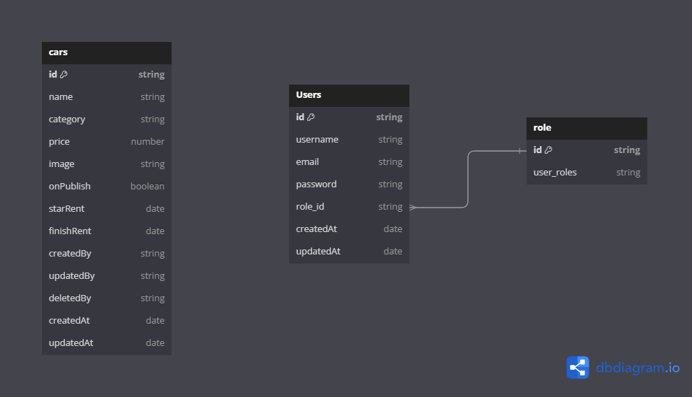

# Binar Car Rental

## Guide to Run 
* `npm i` to install all the dependencies
* Don't forget to make your own `.env`
* When its finish:
    * `npm run build` to compile all these typescript things
    * `npm run dev` to run the server ⚡

## About Migrations and Seeds
* `knex migrate:latest` to run the migration's file
* `knex seed:run` to fill data on database

## Entity Relationship Diagram

For now only one table is available:  
https://dbdiagram.io/d/challenge_6-66444f099e85a46d55e31735    
  

# API DOCUMENTATION BE
https://diverse-corey-alamsyhh-project-bcf73f0c.koyeb.app/api-docs/
# Link Github BE
https://github.com/alamsyhhh/24001160-synrgy7-muh-bcr-server-side-ch8
# Deploy BE
https://diverse-corey-alamsyhh-project-bcf73f0c.koyeb.app

# Link Github FE
https://github.com/alamsyhhh/24001160-synrgy7-muh-bcr-client-side-ch8
# Deploy FE
https://24001160-synrgy7-muh-bcr-client-side-ch8.vercel.app/

## Authorization
* super admin\
  `email` : sAdmin@gmail.com\
  `password`: sadmin12345
  
* admin\
  `email`: admin@gmail.com\
  `password`: admin12345

* member\
  `email`: member@gmail.com\
  `password`: member12345
